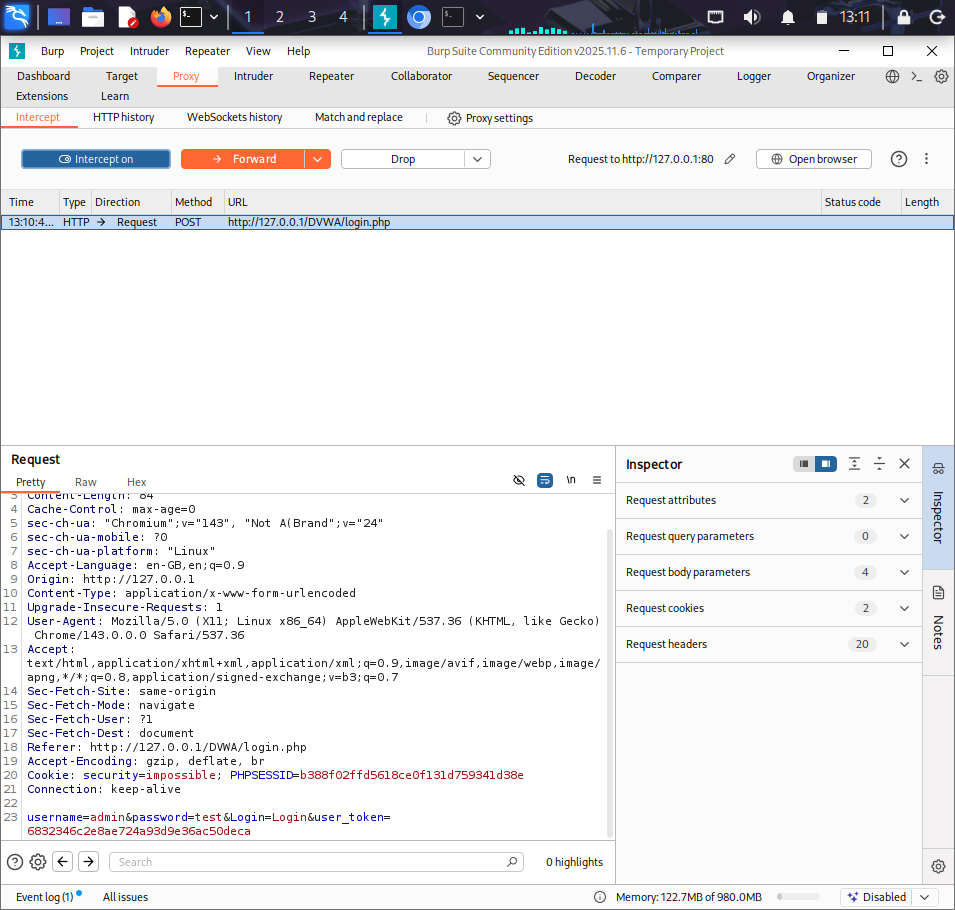
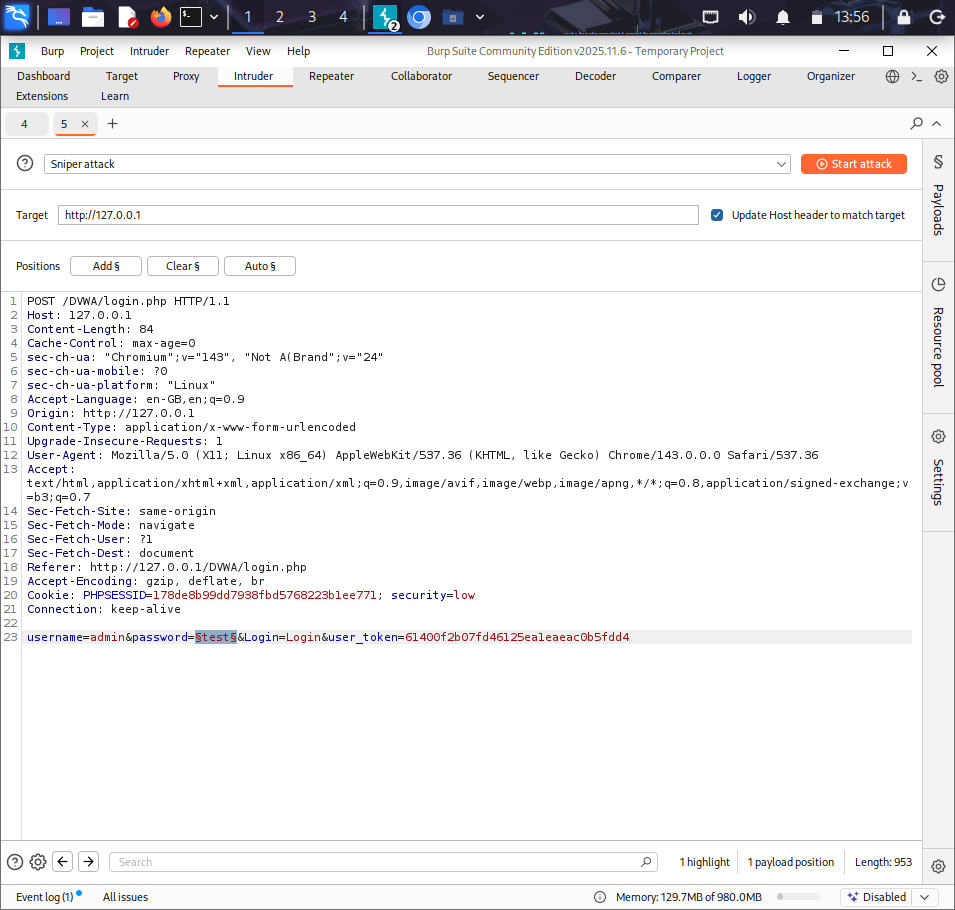
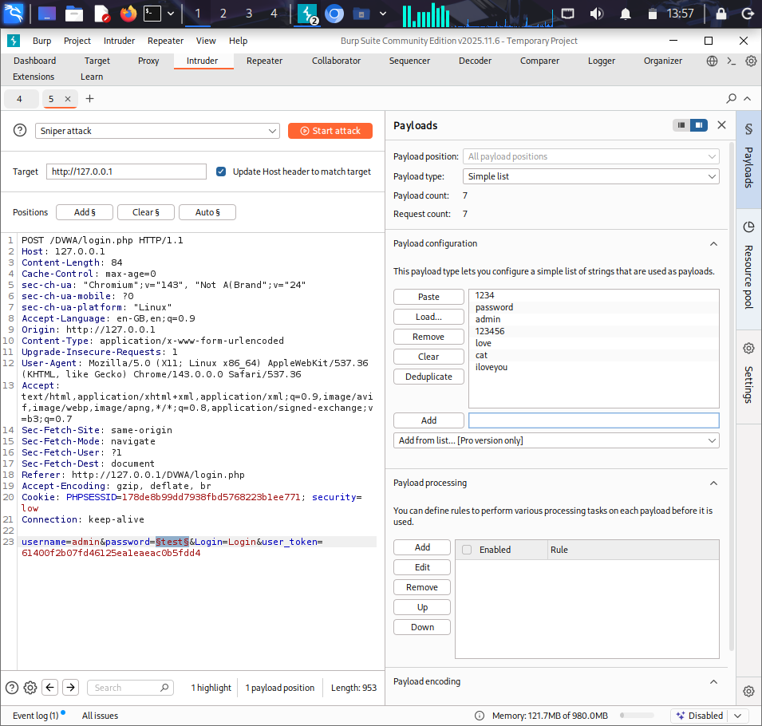
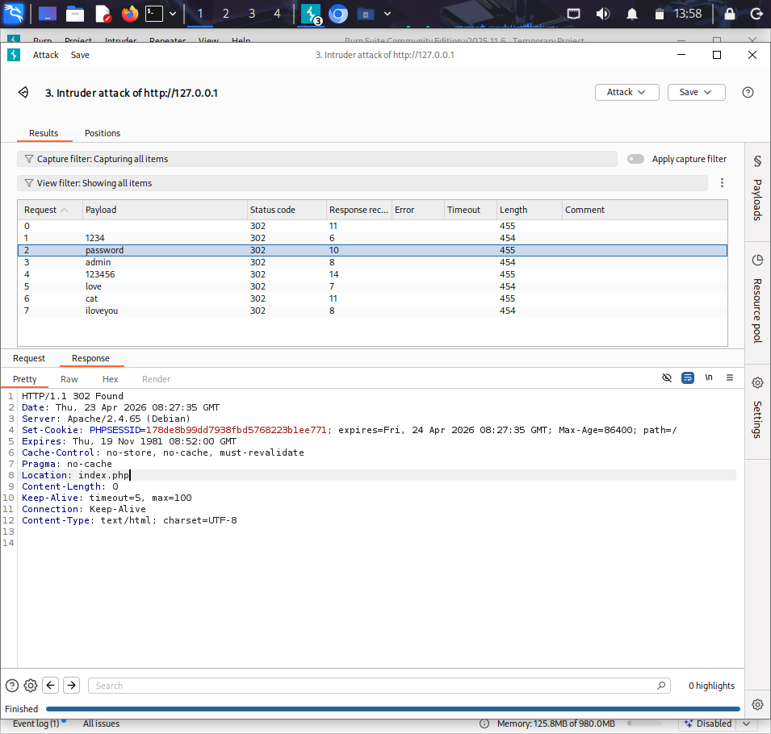

# 🛡️ Burp Suite Project 2 – Password Brute Force using Intruder

## 📌 Project Overview
This project demonstrates how to perform a password brute-force attack on a web login form using Burp Suite Intruder. The objective is to identify weak credentials by automating login attempts.

## 🎯 Objective
- Capture login request using Burp Suite
- Use Intruder to automate password attempts
- Identify correct password based on server response

## 🛠️ Tools Used
- Burp Suite (Community Edition)

## ⚙️ Setup

## 🚀 Procedure

### Step 1: Capture Login Request
- Turn Intercept ON
- Enter:
  username: admin  
  password: test  
- Click Login
- Request will be captured

### Step 2: Send to Intruder
- Right-click request
- Select "Send to Intruder"

### Step 3: Configure Positions
- Go to Intruder → Positions
- Click "Clear §"
- Select password value
- Click "Add §"

Example:
username=admin&password=§test§&Login=Login

### Step 4: Configure Payloads
- Go to Payloads tab
- Payload type: Simple list
- Add passwords manually OR load wordlist

Example passwords:
1234  
password  
admin  
123456
love
cat
iloveyou  

### Step 5: Start Attack
- Click "Start Attack"

### Step 6: Analyze Results (IMPORTANT)
- All responses return status code 302
- Response length is almost identical
- Therefore, length and status are not reliable indicators

### Step 7: Identify Correct Password
- Click each result row
- Open the Response tab
- Check the "Location" header

Find:

Incorrect password:
Location: login.php

Correct password:
Location: index.php

The payload that redirects to index.php is the correct password.

## 🔍 Key Finding
The correct password was identified based on the redirect behavior of the application rather than response size or status code.

## ⚠️ Security Issues
- Weak password policy
- No rate limiting
- No account lockout

## ✅ Recommendations
- Use strong passwords
- Implement login attempt limits
- Enable account lockout
- Use CAPTCHA

## 📸 Screenshots
- Captured request

- Intruder positions

- Payload list

- Attack results

## 🧠 Learning Outcomes
- Learned brute-force attacks
- Understood request automation
- Gained experience with Burp Intruder

## 🚀 Conclusion
This project demonstrates how weak authentication systems can be exploited using automated tools like Burp Suite Intruder.
